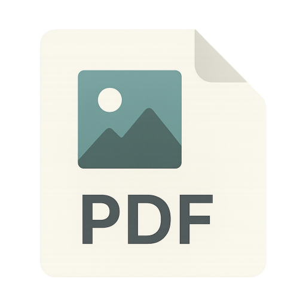

# imgtopdf

<div align="center">



**A powerful, offline-first desktop application for converting images to PDF**

[](https://github.com/munalgar/imgtopdf/actions/workflows/build.yml)
[](https://github.com/munalgar/imgtopdf/actions/workflows/release.yml)
[](https://opensource.org/licenses/MIT)
[](https://github.com/munalgar/imgtopdf/releases)
[](https://www.electronjs.org/)
[](https://reactjs.org/)
[](https://www.typescriptlang.org/)

[Features](#features) • [Installation](#installation) • [Usage](#usage) • [Development](#development) • [Building](#building)

</div>

---

## Overview

**imgtopdf** is a cross-platform desktop application designed for converting batches of images into high-quality PDF documents. Built with privacy in mind, all processing happens locally on your machine—no cloud services, no data collection, no internet required.

Perfect for photographers, designers, document scanners, or anyone who needs to combine images into professional PDF files with full control over output settings.

## Features

### 🖼️ **Comprehensive Format Support**
- **Image Formats**: JPEG, PNG, WebP, HEIC/HEIF, TIFF, BMP
- Automatic format detection and validation
- EXIF orientation handling (auto-rotation)

### 🎯 **Intuitive Drag-and-Drop Interface**
- Drop images directly into the app window
- File browser integration with multi-selection
- Real-time thumbnail preview with file information
- Easy reordering and removal of images

### ⚙️ **Advanced PDF Configuration**
- **Page Sizes**: A4, Letter, Legal, Tabloid, A3, A5, or custom dimensions
- **Margins**: Configurable margins (0-2 inches)
- **Scaling Modes**: 
  - Fit to page (maintain aspect ratio)
  - Fill page (crop to fit)
  - Original size (no scaling)
- **Quality Control**: Adjustable JPEG compression (1-100)
- **Metadata**: Optional EXIF data preservation

### 📊 **Real-Time Feedback**
- Live conversion progress with file-by-file updates
- Cancellation support for long-running jobs
- Warning and error reporting
- Success confirmation with output location

### 🔒 **Privacy-First Design**
- 100% offline processing
- No telemetry or analytics
- No external API calls
- Your images never leave your computer

## Tech Stack

- **[Electron](https://www.electronjs.org/)** - Cross-platform desktop framework
- **[React 19](https://react.dev/)** - UI library with modern hooks
- **[TypeScript](https://www.typescriptlang.org/)** - Type-safe development
- **[Vite](https://vite.dev/)** - Lightning-fast build tool
- **[electron-vite](https://electron-vite.org/)** - Vite-powered Electron tooling
- **[pdf-lib](https://pdf-lib.js.org/)** - PDF generation and manipulation
- **[sharp](https://sharp.pixelplumbing.com/)** - High-performance image processing
- **[Tailwind CSS](https://tailwindcss.com/)** - Utility-first styling

## Installation

### Prerequisites

- **Node.js** 20.19+ or 22.12+ ([Download](https://nodejs.org/))
- **npm** (comes with Node.js)

### Clone and Install

```bash
# Clone the repository
git clone https://github.com/munalgar/imgtopdf.git

# Navigate to project directory
cd imgtopdf

# Install dependencies
npm install
```

## Usage

### For End Users

Download the latest pre-built release for your platform from the [Releases page](https://github.com/munalgar/imgtopdf/releases):

- **Windows**: `imgtopdf-{version}-setup.exe` - Full installer with desktop shortcut
- **macOS**: `imgtopdf-{version}.dmg` - Drag-and-drop disk image
- **Linux**: 
  - `imgtopdf-{version}.AppImage` - Portable, no installation required
  - `imgtopdf-{version}.deb` - Debian/Ubuntu package
  - `imgtopdf-{version}.snap` - Universal Linux package

All releases are automatically built and tested via GitHub Actions.

### Running from Source

```bash
# Start in development mode with hot-reload
npm run dev
```

The application will launch with development tools enabled.

## Development

### Project Structure

```
imgtopdf/
├── src/
│   ├── main/              # Electron main process
│   │   ├── index.ts       # App entry point, IPC handlers
│   │   └── lib/           # Core conversion logic
│   │       ├── conversion-controller.ts  # Orchestrates conversion
│   │       ├── image-processor.ts        # Sharp-powered image ops
│   │       ├── pdf-assembler.ts          # PDF creation with pdf-lib
│   │       ├── file-inspector.ts         # File validation
│   │       └── file-utils.ts             # Helper utilities
│   ├── preload/           # Secure context bridge
│   │   └── index.ts       # Exposed API surface
│   ├── renderer/          # React frontend
│   │   └── src/
│   │       ├── App.tsx              # Main application component
│   │       ├── components/          # UI components
│   │       └── styles/              # Global styles
│   └── common/            # Shared TypeScript types
├── assets/                # Application icons
├── build/                 # Build configuration
├── tests/                 # Integration tests
└── electron-builder.yml   # Distribution config
```

### Available Scripts

```bash
# Development
npm run dev              # Start with hot-reload
npm run start            # Start from built files

# Code Quality
npm run lint             # Run ESLint
npm run lint:fix         # Fix ESLint issues
npm run format           # Format with Prettier
npm run typecheck        # TypeScript type checking

# Testing
npm run test             # Run unit tests
npm run test:integration # Run E2E tests

# Building
npm run build            # Compile source files
npm run build:unpack     # Build without packaging
npm run build:win        # Build Windows installer
npm run build:mac        # Build macOS DMG
npm run build:linux      # Build Linux packages
```

### Development Workflow

1. **Make Changes**: Edit files in `src/`
2. **Test Locally**: `npm run dev` for instant feedback
3. **Type Check**: `npm run typecheck` to catch errors
4. **Lint**: `npm run lint:fix` to clean up code
5. **Format**: `npm run format` for consistent style
6. **Test**: Run integration tests before committing

### Architecture Notes

**Main Process** (`src/main/`)
- Handles file system operations
- Manages IPC communication
- Runs conversion pipeline
- Creates native dialogs

**Preload Script** (`src/preload/`)
- Provides secure bridge between main and renderer
- Exposes minimal API surface
- Prevents direct Node.js access from renderer

**Renderer Process** (`src/renderer/`)
- React-based UI
- Manages application state
- Handles user interactions
- No direct file system access

**Conversion Pipeline**:
1. **Inspector**: Validates files and extracts metadata
2. **Processor**: Decodes, rotates, and resizes images with sharp
3. **Assembler**: Embeds processed images into PDF with pdf-lib
4. **Controller**: Orchestrates the pipeline with progress tracking

## Building

### Platform-Specific Builds

> **Important**: Due to native dependencies (sharp), build on the target platform for best results.

#### Windows

```bash
npm run build:win
```
Output: `dist/imgtopdf-{version}-setup.exe`

#### macOS

```bash
npm run build:mac
```
Output: `dist/imgtopdf-{version}.dmg`

Requirements:
- macOS 10.13+
- Xcode Command Line Tools

#### Linux

```bash
npm run build:linux
```
Outputs:
- `dist/imgtopdf-{version}.AppImage`
- `dist/imgtopdf-{version}.deb`
- `dist/imgtopdf-{version}.snap`

### Build Configuration

Customize builds in `electron-builder.yml`:
- App ID and product name
- Icon paths
- File filters
- Platform-specific settings
- Code signing (macOS/Windows)

## Contributing

Contributions are welcome! Here's how you can help:

1. **Fork the repository**
2. **Create a feature branch**: `git checkout -b feature/amazing-feature`
3. **Commit your changes**: `git commit -m 'Add amazing feature'`
4. **Push to the branch**: `git push origin feature/amazing-feature`
5. **Open a Pull Request**

Please ensure:
- Code passes `npm run typecheck`
- Linting passes `npm run lint`
- Tests pass (if applicable)
- Follow existing code style

## Troubleshooting

### Common Issues

**Sharp Installation Errors**
```bash
# Clear cache and reinstall
rm -rf node_modules package-lock.json
npm install
```

**HEIC/HEIF Not Working**
- Ensure sharp's libvips includes libheif support
- On Linux, install `libheif-dev` package

**Build Fails with Native Dependencies**
- Always build on the target platform
- Check Node.js version (20.19+ or 22.12+)
- Try rebuilding: `npm run postinstall`

## Releases & Distribution

This project uses **GitHub Actions** for automated builds and releases:

- ✅ **Continuous Integration**: Every push to `main` triggers builds on Windows, macOS, and Linux
- ✅ **Automated Releases**: Push a version tag (e.g., `v0.1.0`) to automatically create a GitHub release
- ✅ **Cross-Platform**: All platforms are built simultaneously using GitHub-hosted runners

See [Release Instructions](.github/RELEASE_TEMPLATE.md) for details on publishing new versions.

## Roadmap

- [ ] Drag-to-reorder images
- [ ] PDF page editing (rotate, delete, reorder)
- [ ] OCR support for scanned documents
- [ ] Batch processing presets
- [ ] CLI interface for automation
- [ ] Dark mode support
- [ ] Auto-update mechanism

## License

This project is licensed under the **MIT License** - see the [LICENSE](LICENSE) file for details.

## Acknowledgments

Built with these amazing open-source projects:
- [pdf-lib](https://github.com/Hopding/pdf-lib) for PDF generation
- [sharp](https://github.com/lovell/sharp) for image processing
- [electron-vite](https://github.com/alex8088/electron-vite) for build tooling

---

<div align="center">

Made with ❤️ by [Alejandro Munoz](https://github.com/munalgar)

**[⬆ Back to Top](#imgtopdf)**

</div>
